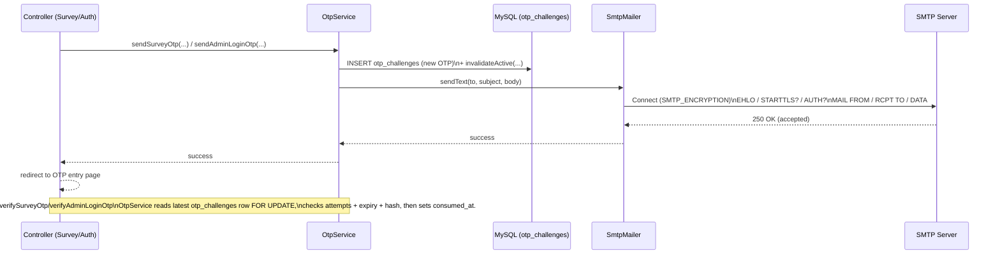

# Miro Flowchart (Copy/Paste)

This document contains **Mermaid** diagrams describing the **actual runtime flows** implemented in this repo.

How to use in Miro:
- Paste a Mermaid block into a Mermaid-capable widget/plugin in Miro (or any Mermaid renderer).
- If you don’t have Mermaid enabled in Miro, you can still use this as a **node/edge blueprint** to recreate the diagram manually.

Referenced entrypoint + router:
- `public/index.php` (front controller + route table + dispatch)

---

## 1) Main Runtime Flow (Front Controller → Routing → Controllers)

```mermaid
flowchart TD
  A[HTTP Request] --> B[public/index.php]
  B --> C{Load config.local.php?\n(if exists)}
  C -->|yes| C1[src/config/config.local.php\n(putenv overrides)]
  C -->|no| D
  C1 --> D[src/config/app.php\n+ src/config/database.php]
  D --> E[Load helpers:\n- src/helpers/csrf.php\n- src/helpers/session.php\n- src/helpers/validation.php\n- src/helpers/export.php\n- src/helpers/security.php]
  E --> F[initializeSecurity()\n+ sessionStart()]
  F --> G[matchRoute(method, uri)]
  G --> H{Route found?}
  H -->|no| Z[404 view\nsrc/views/errors/404.php]
  H -->|yes| I[Dispatch controller/action]

  %% Dispatch targets (high-level)
  I --> S1[SurveyController\nsrc/controllers/SurveyController.php]
  I --> A1[AuthController\nsrc/controllers/AuthController.php]
  I --> AD1[AdminController\nsrc/controllers/AdminController.php]
  I --> P1[PublicApiController\nsrc/controllers/PublicApiController.php]
  I --> SA1[SurveyApiController\nsrc/controllers/SurveyApiController.php]
  I --> ST1[ApiController (auth stats)\nsrc/controllers/ApiController.php]
  I --> IN1[InstallController\nsrc/controllers/InstallController.php]

  %% Shared infra
  S1 --> DB[(MySQL via PDO)\nsrc/config/database.php]
  A1 --> DB
  AD1 --> DB
  P1 --> DB
  SA1 --> DB
```

---

## 2) Survey Respondent Flow (Consent → Steps → Email OTP → Submit)

Routes (from `public/index.php`):
- `GET /survey/consent` → `SurveyController::showStep(step=1)`
- `POST /survey/consent` → `SurveyController::saveStep(step=1)`
- `GET /survey/step/{step}` → `SurveyController::showStep(step)`
- `POST /survey/step/{step}` → `SurveyController::saveStep(step)`
- `GET /survey/verify-email` → `SurveyController::showVerifyEmail()`
- `POST /survey/verify-email` → `SurveyController::verifyEmail()`
- `POST /survey/verify-email/resend` → `SurveyController::resendEmailOtp()`
- `POST /api/survey/submit` → `SurveyApiController::submit()` (CSRF-protected JSON)

```mermaid
flowchart TD
  U[Respondent] --> C[GET /survey/consent]
  C --> S[SurveyController::showStep(1)]
  S --> V1[Render consent view\nsrc/views/survey/consent.php]

  U --> P1[POST /survey/consent]
  P1 --> S2[SurveyController::saveStep(1)]
  S2 --> VAL1[validateStep1()\nsrc/helpers/validation.php]
  VAL1 -->|consent=true| SS1[saveSurveyStepData(1)\n+ sessionRegenerate()]
  VAL1 -->|consent=false| DCL[clearSurveySession()\nredirect /survey/declined]

  SS1 --> STEP2[GET /survey/step/2]
  STEP2 --> S3[SurveyController::showStep(2)]
  S3 --> V2[Render step 2 view\nsrc/views/survey/basic-info.php]

  U --> P2[POST /survey/step/2]
  P2 --> S4[SurveyController::saveStep(2)]
  S4 --> VAL2[validateStepBasicInfo()\nsrc/helpers/validation.php]
  VAL2 -->|ok| OTP_SEND[OtpService::sendSurveyOtp()\nsrc/services/OtpService.php]
  OTP_SEND --> OTPPAGE[redirect /survey/verify-email]

  U --> OTPGET[GET /survey/verify-email]
  OTPGET --> SV[SurveyController::showVerifyEmail()]
  SV --> OTPVIEW[Render verify view\nsrc/views/survey/verify-email.php]

  U --> OTPPOST[POST /survey/verify-email]
  OTPPOST --> VER[SurveyController::verifyEmail()]
  VER --> OTPVERIFY[OtpService::verifySurveyOtp()]
  OTPVERIFY -->|ok| STEP3[GET /survey/step/3]
  OTPVERIFY -->|fail| OTPVIEW

  STEP3 --> STEP8[Steps 3..8\nSurveyController::showStep/saveStep]
  STEP8 --> SUBMIT[POST /api/survey/submit]
  SUBMIT --> API[SurveyApiController::submit()]
  API --> DB[(Insert survey_responses + multi-value tables)]
  API --> TY[redirect /survey/thank-you]
```

---

## 3) Admin Flow (Login → OTP → Dashboard → View → Export)

Routes (from `public/index.php`):
- `GET /admin/login` → `AuthController::showLogin()`
- `POST /admin/login` → `AuthController::login()`
- `GET /admin/otp` → `AuthController::showOtp()`
- `POST /admin/otp` → `AuthController::verifyOtp()`
- `POST /admin/otp/resend` → `AuthController::resendOtp()`
- `GET /admin/dashboard` → `AdminController::dashboard()`
- `GET /admin/responses` → `AdminController::responses()`
- `GET /admin/responses/{id}` → `AdminController::viewResponse($id)`
- `GET /admin/export/csv` → `AdminController::exportCsv()`

```mermaid
flowchart TD
  A[Admin] --> L1[GET /admin/login]
  L1 --> AL[AuthController::showLogin()]
  AL --> LV[Render admin login\nsrc/views/admin/login.php]

  A --> L2[POST /admin/login]
  L2 --> AUTH[AuthController::login()]
  AUTH --> DB[(admin_users lookup)]
  AUTH -->|password ok| OTP1[OtpService::sendAdminLoginOtp()]
  AUTH -->|password fail| LV

  A --> O1[GET /admin/otp]
  O1 --> OS[AuthController::showOtp()]
  OS --> OV[Render admin OTP\nsrc/views/admin/otp.php]

  A --> O2[POST /admin/otp]
  O2 --> OVFY[AuthController::verifyOtp()]
  OVFY --> OTPCHK[OtpService::verifyAdminLoginOtp()]
  OTPCHK -->|ok| DASH[GET /admin/dashboard]
  OTPCHK -->|fail| OV

  DASH --> AD[AdminController::dashboard()]
  AD --> DV[Render dashboard\nsrc/views/admin/dashboard.php]

  A --> R1[GET /admin/responses]
  R1 --> AR[AdminController::responses()]
  AR --> RV[Render list\nsrc/views/admin/responses.php]

  A --> R2[GET /admin/responses/{id}]
  R2 --> VR[AdminController::viewResponse(id)]
  VR --> DB
  VR --> RD[Render detail\nsrc/views/admin/response-detail.php]

  A --> EX[GET /admin/export/csv]
  EX --> EC[AdminController::exportCsv()]
  EC --> EXP[exportSurveyToCsv()\nsrc/helpers/export.php]
  EXP --> DL[Browser downloads CSV]
```

---

## 4) PSGC Drilldown Flow (Region → Province → City + Import)

User-facing (Survey Step 3 view):
- `src/views/survey/office-data.php` (JS fetches PSGC options)

Public APIs (from `public/index.php`):
- `GET /api/psgc/regions` → `PublicApiController::psgcRegions()`
- `GET /api/psgc/provinces?region_code=...` → `PublicApiController::psgcProvinces()`
- `GET /api/psgc/cities?province_code=...` → `PublicApiController::psgcCities()`

Admin import:
- `POST /admin/import/psgc` → `AdminController::importPsgc()` → `PsgcImportService::importFromCsv()`

PSGC sources:
- CSV: `docs/update/lib_psgc_2025.csv`
- DB table: `ref_psgc_city`

```mermaid
flowchart TD
  UI[Survey Step 3\nsrc/views/survey/office-data.php] --> RGN[GET /api/psgc/regions]
  RGN --> PR[PublicApiController::psgcRegions()]
  PR --> DB[(ref_psgc_city)]
  PR --> UI

  UI --> PROV[GET /api/psgc/provinces?region_code=...]
  PROV --> PP[PublicApiController::psgcProvinces()]
  PP --> DB
  PP --> UI

  UI --> CITY[GET /api/psgc/cities?province_code=...]
  CITY --> PC[PublicApiController::psgcCities()]
  PC --> DB
  PC --> UI

  ADM[Admin] --> IMP[POST /admin/import/psgc]
  IMP --> AI[AdminController::importPsgc()]
  AI --> SVC[PsgcImportService::importFromCsv()\nsrc/services/PsgcImportService.php]
  SVC --> CSV[docs/update/lib_psgc_2025.csv]
  SVC --> DB
```

---

## 5) OTP Email Send Flow (OtpService → SmtpMailer → SMTP)

Key services:
- `src/services/OtpService.php`
- `src/services/SmtpMailer.php`



---

## (Optional) Manual Diagram Blueprint (Nodes/Edges)

If you need a plain list to recreate in Miro without Mermaid:

- **Entry**: `public/index.php`
  - loads `src/config/config.local.php` (optional)
  - loads `src/config/app.php`, `src/config/database.php`
  - loads helpers: `src/helpers/*`
  - routes → controller/action

- **Survey**:
  - `SurveyController::showStep/saveStep/showVerifyEmail/verifyEmail/resendEmailOtp/thankYou`
  - `OtpService::sendSurveyOtp/verifySurveyOtp`
  - `SurveyApiController::submit`

- **Admin**:
  - `AuthController::showLogin/login/showOtp/verifyOtp/resendOtp/logout`
  - `AdminController::dashboard/responses/viewResponse/exportCsv/importPsgc`
  - `exportSurveyToCsv` (`src/helpers/export.php`)

- **PSGC**:
  - `PublicApiController::psgcRegions/psgcProvinces/psgcCities`
  - `PsgcImportService::importFromCsv`
  - Table `ref_psgc_city`

